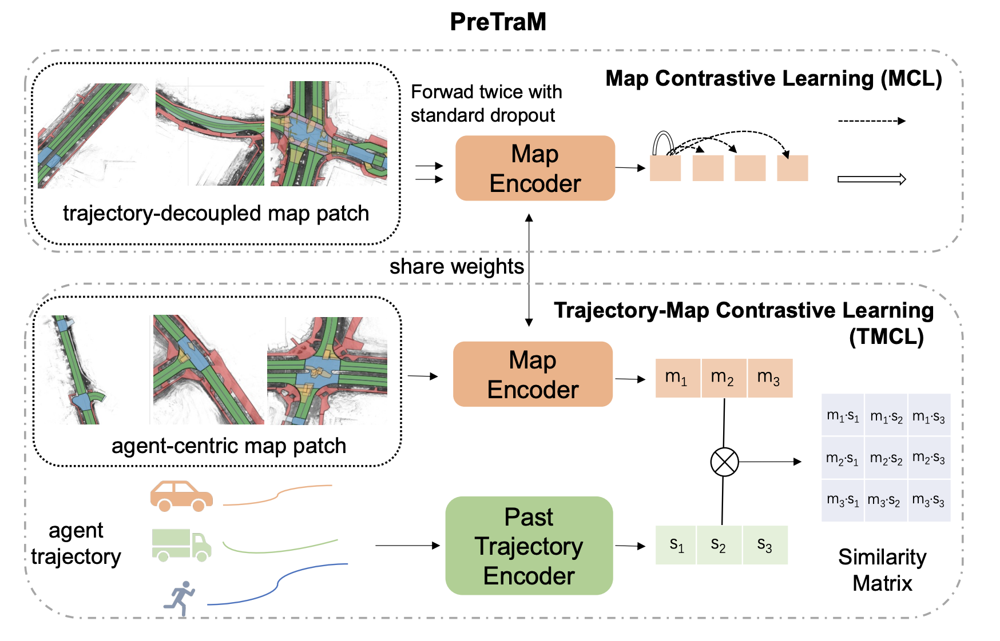

# PreTraM
This repo contains the official implementation of our paper:
  
PreTraM: Self-Supervised Pre-training via Connecting Trajectory and Map
by *Chenfeng Xu, Tian Li, Chen Tang, Lingfeng Sun, Kurt Keutzer ,Masayoshi Tomizuka, Alireza Fathi, Wei Zhan*

**ECCV 2022**  [paper](https://arxiv.org/abs/2204.10435)

# Overview
We propose PreTraM, a self-supervised pre-training scheme via connecting trajectories and maps for trajectory forecasting. Specifically, PreTraM consists of two parts: 1) Trajectory-Map Contrastive Learning, where we project trajectories and maps to a shared embedding space with cross-modal contrastive learning, and 2) Map Contrastive Learning, where we enhance map representation with contrastive learning on large quantities of HD-maps. The framework is shown below.


<p align="center">
    
</p>

We release the reproduced Agentformer which supports parallel training. Note that in our paper, we only focus on the representation learning so we do not try to reproduce Dlow. In this repo, we also include our implementation of Dlow which supports parallel training. Please note that the reproduced result with Dlow is not as good as the original Agentformer. 

If you find this work useful for your research, please consider citing:

```
@article{xu2022pretram,
  title={PreTraM: Self-Supervised Pre-training via Connecting Trajectory and Map},
  author={Xu, Chenfeng and Li, Tian and Tang, Chen and Sun, Lingfeng and Keutzer, Kurt and Tomizuka, Masayoshi and Fathi, Alireza and Zhan, Wei},
  journal={arXiv preprint arXiv:2204.10435},
  year={2022}
}
```

# Installation 

### Environment
* **Tested OS:** MacOS, Linux
* Python >= 3.7
* PyTorch == 1.8.0
### Dependencies:
1. Install [PyTorch 1.8.0](https://pytorch.org/get-started/previous-versions/) with the correct CUDA version.
2. Install the dependencies:
    ```
    pip install -r requirements.txt
    ```

### Datasets
* For the nuScenes dataset, the following steps are required:
  1. Download the orignal [nuScenes](https://www.nuscenes.org/nuscenes) dataset. Checkout the instructions [here](https://github.com/nutonomy/nuscenes-devkit).
  2. Follow the [instructions](https://github.com/nutonomy/nuscenes-devkit#prediction-challenge) of nuScenes prediction challenge. Download and install the [map expansion](https://github.com/nutonomy/nuscenes-devkit#map-expansion).
  3. Run our [script](data_util/process_nuscenes.py) to obtain a processed version of the nuScenes dataset under [datasets/nuscenes_pred](datasets/nuscenes_pred):
      ```
      python data_util/process_nuscenes.py --data_root <PATH_TO_NUSCENES>
      ``` 

# Training

1. Pretraining:
```
CUDA_VISIBLE_DEVICES=0 python train.py --cfg nuscenes_5sample_pretrain --log_dir <PRETRAIN_DIR>
```
2. After pretraining:
```
CUDA_VISIBLE_DEVICES=0 python train.py --cfg nuscenes_5sample_agentformer_pre --ckpt_path <PRETRAIN_DIR>/model_best.pth --log_dir <BEFORE_DLOW_DIR>
```
So far you may reproduce the results in our paper. To get the better results, you could try our reproduced Dlow training as below.

3. Dlow Training:
```
CUDA_VISIBLE_DEVICES=0 python train.py --cfg nuscenes_5sample_dlow --model_path <BEFORE_DLOW_DIR>/model_best.pth --log_dir <DLOW_DIR>
```


# Evaluation
You can evaluate your model by 
```
CUDA_VISIBLE_DEVICES=0 python test.py --cfg nuscenes_5sample_agentformer_pre --ckpt_dir <FINETUNE_DIR>
```

# Acknowledgement
This project is not possible without great open-sourced code bases. We appreciate the open-source of [Agentformer](https://github.com/Khrylx/AgentFormer) and [Trajectron++](https://github.com/StanfordASL/Trajectron-plus-plus).
